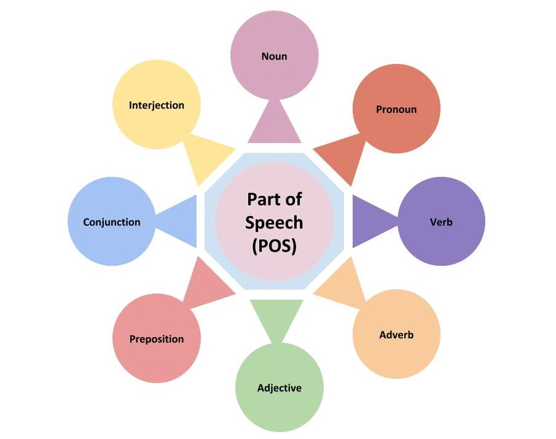

# POS_tagging

Project work for the "Natural Language Processing" course of the Artificial Intelligence Master's Degree at University of Bologna

POS-tagging (part-of-speech tagging) is a process of assigning each word in a sentence a label that indicates its part of speech, such as noun, verb, adjective, adverb, etc. It is a way of analyzing sentence terms and assigning them a tag, thus providing further information about the sentence structure and meaning.

Example:

# Authors 

* Daniele Marini
* Iulian Zorila
* Davide Brescia

# Goal 
The objective of this project is to automatically perform POS-tagging by the means of deep neural networks, using pretrained word-embeddings.

# Dataset
The dataset can be downloaded from [here](https://raw.githubusercontent.com/nltk/nltk_data/gh-pages/packages/corpora/dependency_treebank.zip), consisting of 200 files. We splitted them as such:

* 1-100 train set
* 101-150 validation set
* 151-199 test set

# Models
Each tested architecture includes the same Embedding and dense layer (used for classification of the 45 POS tags). In particular we trained the following type of models:

* Baseline with Bidirectional LSTM layer.
* Variation with Bidirectional GRU layer.
* Variation with double Bidirectional LSTM layer.
* Variation with Bidirectional LSTM and dense layer.

To understand the best configuration of units per each layer, we performed a GridSearch over the number of units and trained a total of 60 models. The process took around 1 hour using the Colab GPU.

# Results

In the picture the numbers above each curve point specifies the number of trained epochs

To evaluate each model we adopted the Macro F1 score and afterwords performed an in depth analysis to check the most common mistakes and overall performance.
